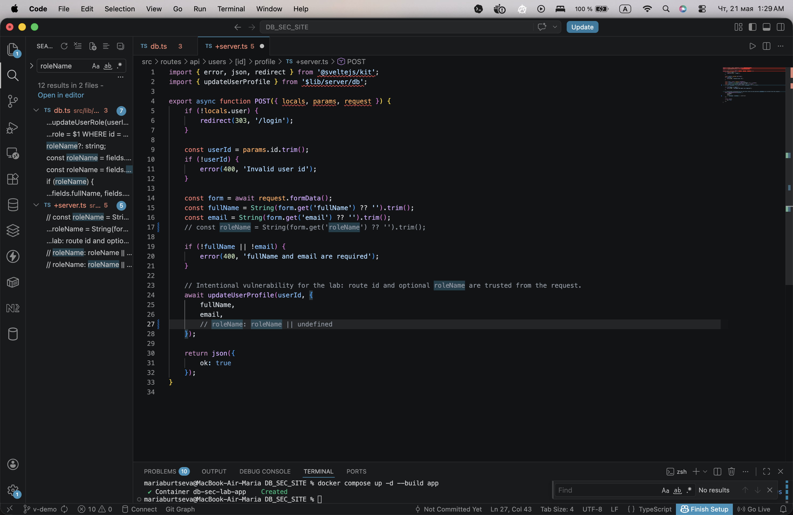
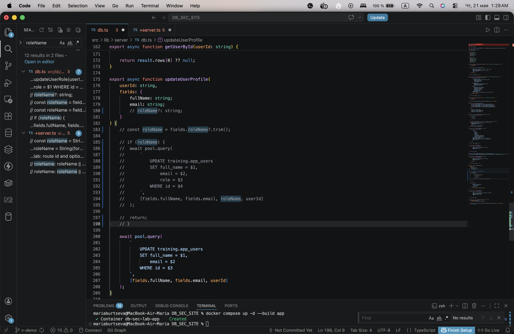

# Обход аутентификации

## 1. Результат уязвимости

Из-за ошибки в обработке формы профиля обычный пользователь мог повысить свои права до администратора. Пользователь `alice` с ролью `student` добавлял в форму скрытое поле `roleName` со значением `admin`, сохранял профиль и после этого отображался в системе уже как `alice (admin)`.

Это означало, что сервер доверял данным, которые пришли от клиента, и позволял менять роль пользователя через обычную форму профиля.


## 2. Как была найдена уязвимость

1. Открыла сайт и вошла под обычной учетной записью `alice`.
2. Перешла на страницу профиля пользователя.
3. Проверила, какие данные отправляет форма при сохранении профиля.
4. Через инструменты разработчика заметила, что форму можно изменить прямо в браузере перед отправкой.
5. Вставила в форму скрытое поле `roleName` со значением `admin`.
6. Нажала кнопку сохранения профиля.
7. После сохранения роль пользователя изменилась с `student` на `admin`.

Использованный код для вставки скрытого поля в форму:

```javascript
const form = document.querySelector('form');
const input = document.createElement('input');
input.type = 'hidden';
input.name = 'roleName';
input.value = 'admin';
form.appendChild(input);
```

После выполнения этого кода в форме появлялось дополнительное поле:

```html
<input type="hidden" name="roleName" value="admin">
```

## 3. Причина уязвимости

Причина была в том, что сервер принимал поле `roleName` из запроса и использовал его при обновлении профиля пользователя. Пользователь не должен иметь возможность менять свою роль через клиентскую форму, даже если такое поле добавлено вручную через DevTools или консоль браузера.

Роль пользователя должна назначаться и изменяться только на стороне сервера в отдельной административной логике.

## 4. Исправление

В исправлении поле `roleName` больше не берется из формы профиля и не передается в функцию обновления пользователя.

### Код до исправления

В обработчике профиля сервер читал роль из `FormData` и передавал ее дальше вместе с остальными полями профиля:

```typescript
const form = await request.formData();
const fullName = String(form.get('fullName') ?? '').trim();
const email = String(form.get('email') ?? '').trim();
const roleName = String(form.get('roleName') ?? '').trim();

await updateUserProfile(userId, {
    fullName,
    email,
    roleName: roleName || undefined
});
```

В запросе к базе это поле попадало в обновление роли пользователя:

```typescript
await pool.query(
    `
        UPDATE training.app_users
        SET full_name = $1,
            email = $2,
            role = $3
        WHERE id = $4
    `,
    [fields.fullName, fields.email, roleName, userId]
);
```



Также в запросе к базе данных обновляются только разрешенные поля профиля: имя и email. Роль пользователя больше не обновляется через этот маршрут.

### Код после исправления

После исправления строки, которые читали `roleName` из формы, были убраны из рабочей логики. В обработчике остаются только поля, которые пользователь действительно может менять:

```typescript
const form = await request.formData();
const fullName = String(form.get('fullName') ?? '').trim();
const email = String(form.get('email') ?? '').trim();
// const roleName = String(form.get('roleName') ?? '').trim();

await updateUserProfile(userId, {
    fullName,
    email
});
```

Функция обновления профиля тоже больше не принимает роль и не записывает ее в таблицу:

```typescript
export async function updateUserProfile(
    userId: string,
    fields: {
        fullName: string;
        email: string;
        // roleName?: string;
    }
) {
    await pool.query(
        `
            UPDATE training.app_users
            SET full_name = $1,
                email = $2
            WHERE id = $3
        `,
        [fields.fullName, fields.email, userId]
    );
}
```



## 5. Вывод

Уязвимость позволяла обойти разграничение прав и самостоятельно получить роль администратора. Для исправления нужно не доверять полям, добавленным на клиенте, и на сервере явно разрешать только те параметры, которые пользователь действительно может менять.
