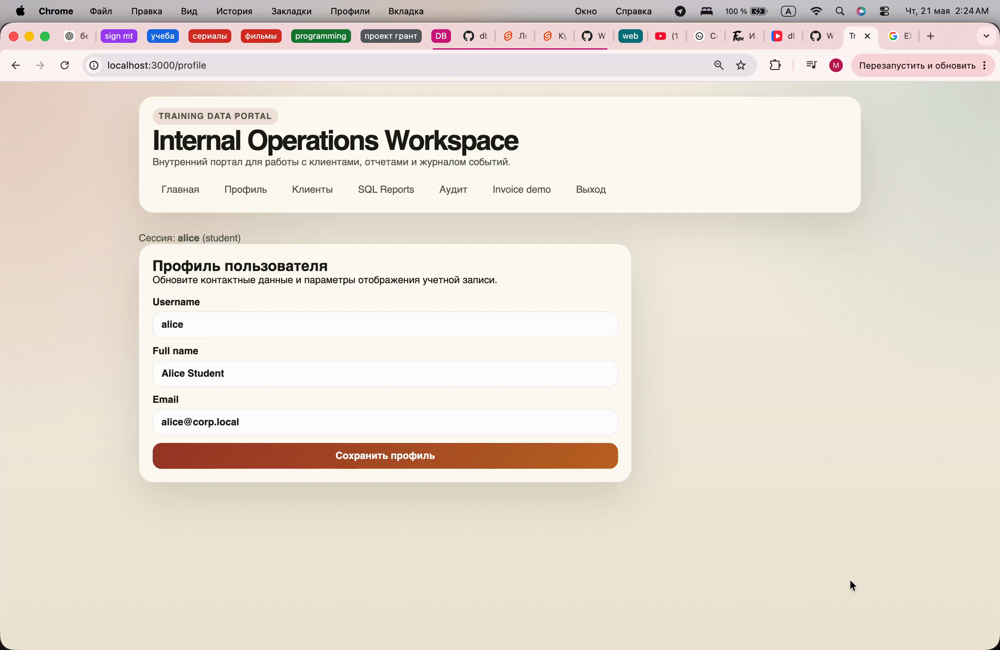

# Извлечение данных через UNION

## 1. Результат уязвимости

Через поле поиска клиентов был введен SQL-фрагмент с `UNION SELECT`. Из-за этого в результат выдачи удалось добавить не настоящую запись из таблицы `training.customers`, а строку, сформированную прямо внутри SQL-инъекции.

В демонстрации использовался такой фрагмент:

```sql
' AND 1=0 UNION SELECT 0, 'mashka', 'email', 'LUX', '00000000-0000-0000-0000-000000000000'::uuid --
```

После выполнения запроса в таблице результатов появилась строка с данными `mashka`, `email`, `LUX` и UUID `00000000-0000-0000-0000-000000000000`.



## 2. Как была найдена уязвимость

1. Открыла страницу клиентов и сначала ввела обычный поисковый запрос `alice@corp.local`. Так было видно, что поле действительно фильтрует клиентов по email и возвращает подходящие записи.
2. Затем ввела одинарную кавычку `'`. Это нужно было, чтобы проверить, попадает ли введенный текст прямо внутрь SQL-строки. Если после кавычки запрос начинает вести себя неправильно или возвращает ошибку, значит кавычка ломает SQL-синтаксис и поле может быть уязвимо к SQL-инъекции.
3. После этого ввела условие `' OR 1=1 --`. В результате были получены все данные клиентов, что подтвердило возможность менять условие `WHERE`.
4. Потом ввела `' AND 1=0 --`. Это обратная проверка: `AND 1=0` делает условие всегда ложным, поэтому совпадений не должно быть. Так было подтверждено, что введенный SQL действительно влияет на результат запроса.
5. После этих проверок был введен payload с `UNION SELECT`, чтобы не просто изменить фильтр, а добавить в выдачу строку, сформированную внутри SQL-инъекции.

Использованный payload:

```sql
' AND 1=0 UNION SELECT 0, 'mashka', 'email', 'LUX', '00000000-0000-0000-0000-000000000000'::uuid --
```

## 3. Причина уязвимости

Причина уязвимости находилась в файле `src/lib/server/db.ts`, в функции `unsafeSearchCustomers(search: string)`.

До исправления значение из поля поиска попадало внутрь SQL-строки через интерполяцию. Пользовательский ввод подставлялся прямо в условие `ILIKE`, поэтому можно было закрыть строку, дописать свое условие и добавить `UNION SELECT`.

Код до исправления:

```typescript
    // Intentional vulnerability for the lab: user input is concatenated into SQL.
    const sql = `SELECT id, full_name, email, tier, owner_user_id
        FROM training.customers
        WHERE email ILIKE '%${normalized}%'
        ORDER BY id`;

    const result = await pool.query(sql);
    return { sql, rows: result.rows };
}
```

Наглядно это показано на скриншоте:


## 4. Исправление

После исправления SQL-запрос больше не собирается путем прямой подстановки пользовательского ввода. Вместо этого в запросе используется параметр `$1`, а значение поиска передается вторым аргументом в `pool.query`.

Код после исправления:

```typescript
    // Intentional vulnerability for the lab: user input is concatenated into SQL.
    const sql = `SELECT id, full_name, email, tier, owner_user_id
        FROM training.customers
        WHERE email ILIKE $1
        ORDER BY id`;

    const result = await pool.query(sql, [`%${normalized}%`]);
    return { sql, rows: result.rows };
}
```

Теперь введенный текст воспринимается как значение параметра поиска, а не как часть SQL-команды. Поэтому `UNION SELECT` больше не может изменить структуру запроса.

Наглядное подтверждение исправления:


## 5. Вывод

Уязвимость позволяла извлекать или подмешивать данные через `UNION SELECT`, потому что пользовательский ввод напрямую объединялся с SQL-запросом. Исправление заключается в использовании параметризованного запроса: SQL-шаблон остается неизменным, а ввод пользователя передается отдельно как значение параметра.
