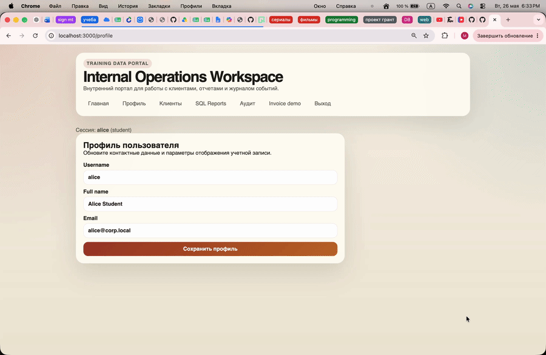

# IDOR: изменение чужого профиля через подмену id

## 1. Результат уязвимости

Обычный пользователь `alice` с ролью `student` смог отправить POST-запрос на изменение профиля другого пользователя, подставив чужой id в URL запроса вида:

```text
POST /api/users/{id}/profile
```

В демонстрации через браузер и DevTools было видно, что запрос на чужой id вернул:

```text
status: 200
statusText: "OK"
ok: true
```

То есть сервер принял запрос от Alice на изменение профиля пользователя с другим id.

После этого в интерфейсе отчета было видно, что данные чужого пользователя действительно изменились: у записи `Denis Morozov` владелец стал отображаться как `Bobik`.



## 2. Как была найдена уязвимость

1. Я вошла на сайт под обычным пользователем `alice`.
2. На странице было видно, что текущая сессия - `alice (student)`.
3. Открыла страницу «Профиль».
4. Через DevTools во вкладке Network сохранила свой профиль и увидела, что профиль сохраняется POST-запросом на адрес вида:

```text
/api/users/{user_id}/profile
```

5. После этого на странице «Клиенты» в интерфейсе были видны id владельцев записей. Среди них был id другого пользователя.
6. В DevTools через Console отправила запрос на такой же endpoint, но вместо своего id подставила чужой id:

```text
/api/users/8ce21d94-2285-4cfa-9462-8d886261a847/profile
```

7. В теле запроса передала новые данные профиля для чужого пользователя.
8. Сервер вернул успешный ответ `200 OK`, хотя запрос был отправлен из сессии `alice`.
9. После проверки в интерфейсе отчета было видно, что имя владельца изменилось на `Bobik`.

## 3. Причина уязвимости

Причина была в том, что сервер доверял id пользователя из URL. До исправления обработчик брал `params.id`, проверял только то, что id не пустой, и передавал его в `updateUserProfile`.

Из-за этого любой авторизованный пользователь мог отправить запрос на маршрут `/api/users/{id}/profile` с чужим id и обновить профиль другого пользователя.

### Код до исправления

```typescript
export async function POST({ locals, params, request }) {
    if (!locals.user) {
        redirect(303, '/login');
    }

    const userId = params.id.trim();
    if (!userId) {
        error(400, 'Invalid user id');
    }

    const form = await request.formData();
    const fullName = String(form.get('fullName') ?? '').trim();
    const email = String(form.get('email') ?? '').trim();

    await updateUserProfile(userId, {
        fullName,
        email
    });

    return json({
        ok: true
    });
}
```

В этом варианте `userId` полностью зависел от `params.id`, то есть от id в URL. Сессия проверялась только на наличие пользователя, но не связывалась с тем id, который обновлялся.


## 4. Исправление

После исправления сервер сравнивает id из маршрута с id текущего пользователя из сессии. Если `routeUserId` не совпадает с `locals.user.id`, сервер возвращает ошибку `403 Forbidden`.

Также обновление профиля выполняется для `locals.user.id`, то есть для пользователя из текущей сессии, а не для произвольного id из URL.

### Код после исправления

```typescript
export async function POST({ locals, params, request }) {
    if (!locals.user) {
        throw error(401, 'Unauthorized');
    }

    const routeUserId = params.id.trim();

    if (!routeUserId) {
        throw error(400, 'Invalid user id');
    }

    if (routeUserId !== locals.user.id) {
        throw error(403, 'Forbidden: you can update only your own profile');
    }

    const form = await request.formData();
    const fullName = String(form.get('fullName') ?? '').trim();
    const email = String(form.get('email') ?? '').trim();

    await updateUserProfile(locals.user.id, {
        fullName,
        email
    });

    return json({
        ok: true
    });
}
```

Теперь id из маршрута используется только для проверки соответствия текущей сессии. Само обновление выполняется по `locals.user.id`, поэтому пользователь не может выбрать чужой профиль через URL.


## 5. Вывод

Уязвимость позволяла обычному пользователю изменять профиль другого пользователя через подмену id в URL запроса. Для исправления нужно проверять на сервере, что пользователь изменяет только свой профиль, и не доверять id, который пришел от клиента.
